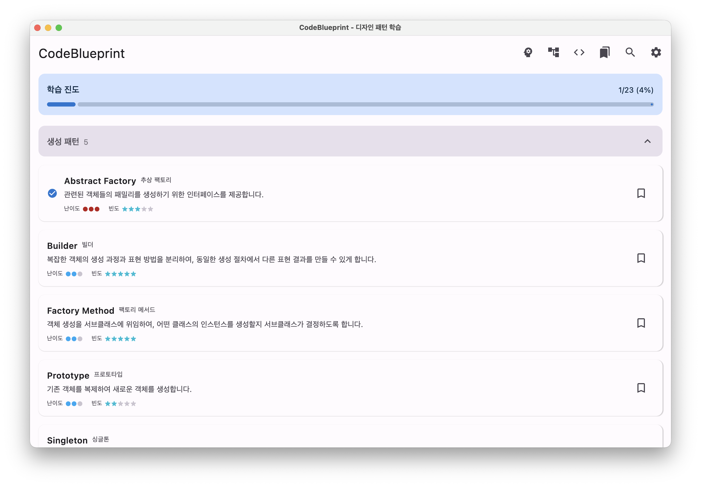
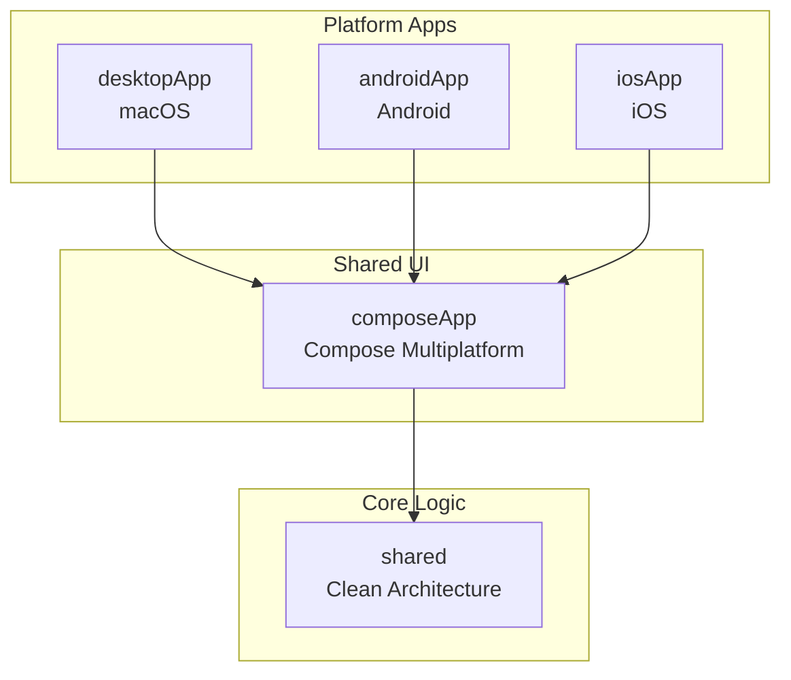
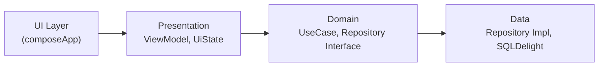
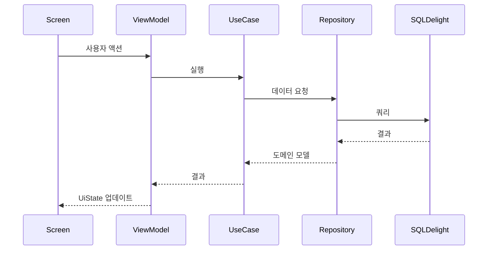

# CodeBlueprint

[](https://kotlinlang.org)
[](https://www.jetbrains.com/lp/compose-multiplatform/)
[]()
[](LICENSE)

> GoF 23개 디자인 패턴과 73개 알고리즘을 빠르게 검색하고 참조할 수 있는 개발자 도구

CodeBlueprint는 Kotlin Multiplatform과 Compose Multiplatform을 기반으로 macOS, Android, iOS에서 동일한 코드베이스로 실행되는 소프트웨어 설계 패턴 참조 애플리케이션입니다.

## 스크린샷

### macOS



*디자인 패턴 목록 화면 - 생성 패턴 카테고리*

## 주요 기능

### 디자인 패턴

- **23개 GoF 디자인 패턴** 수록
  - 생성 패턴 (5개): Singleton, Factory Method, Abstract Factory, Builder, Prototype
  - 구조 패턴 (7개): Adapter, Bridge, Composite, Decorator, Facade, Flyweight, Proxy
  - 행위 패턴 (11개): Chain of Responsibility, Command, Iterator, Mediator, Memento, Observer, State, Strategy, Template Method, Visitor, Interpreter
- 패턴별 상세 설명, 장단점, 활용 사례 제공
- **다국어 코드 예시**: Kotlin, Java, Swift, Python, JavaScript

### 알고리즘

- **73개 핵심 알고리즘** 수록 (9개 카테고리)
  - 정렬 (13개), 탐색 (8개), 그래프 (12개), 동적 프로그래밍 (8개)
  - 분할 정복 (5개), 탐욕 (5개), 백트래킹 (5개), 문자열 (7개), 수학 (10개)
- 시간/공간 복잡도 분석
- 구현 코드 및 활용 사례

### 아키텍처 패턴

- **5가지 아키텍처 패턴** 수록
  - MVC (Model-View-Controller)
  - MVP (Model-View-Presenter)
  - MVVM (Model-View-ViewModel)
  - Clean Architecture
  - MVI (Model-View-Intent)
- 계층별 역할 및 책임 설명
- 다이어그램 및 비교 분석 (복잡도, 테스트 용이성, 확장성 등)
- Android 권장 여부 표시

### 코드 플레이그라운드

- **5개 언어 지원**: Kotlin, Java, Python, JavaScript, Swift
- 코드 직접 편집 및 실행 시뮬레이션
- **문자열 템플릿 지원**:
  - Kotlin: `$var`, `${expr}`
  - Python: f-string `{var}`
  - JavaScript: 템플릿 리터럴 `` `${var}` ``
  - Swift: `\(var)`
  - Java: 문자열 연결 `+`
- 실행 결과 및 실행 시간 표시

### 빠른 접근 및 검색

- **통합 검색**: 패턴과 알고리즘을 동시에 검색, 탭 UI로 결과 구분
- **북마크**: 자주 참조하는 패턴/알고리즘 저장
- **빠른 접근**: 북마크된 항목을 목록 상단에 칩으로 표시
- **설정**: 테마, 기본 코드 언어 설정

---

## 아키텍처

### 모듈 구조



### Clean Architecture 레이어



### 데이터 흐름



---

## 기술 스택

| 용도 | 라이브러리 |
|------|-----------|
| **언어** | Kotlin 2.0, Kotlin Multiplatform |
| **UI** | Compose Multiplatform, Material 3 |
| **DI** | Koin |
| **Database** | SQLDelight |
| **Navigation** | Decompose |
| **Async** | Kotlin Coroutines |
| **Serialization** | kotlinx.serialization |

---

## 시작하기

### 요구사항

- **JDK 17** 이상
- **Android SDK** API 35 이상 (Android 빌드)
  - `local.properties`에 SDK 경로 설정: `sdk.dir=/path/to/Android/sdk`
- **Xcode 15** 이상 (iOS 빌드)

### 빌드 및 실행

```bash
# Desktop (macOS) 앱 실행
./gradlew desktopApp:run

# Android 앱 빌드
./gradlew androidApp:assembleDebug

# iOS 앱 (Xcode에서 열기)
open iosApp/iosApp.xcodeproj

# 전체 빌드
./gradlew build
```

---

## 프로젝트 구조

```
CodeBlueprint/
├── shared/                          # 공유 비즈니스 로직 (Clean Architecture)
│   └── src/
│       ├── commonMain/
│       │   ├── domain/              # UseCase, Repository Interface, Model
│       │   │   ├── model/           # DesignPattern, Algorithm, Settings 등
│       │   │   ├── repository/      # Repository 인터페이스
│       │   │   └── usecase/         # 비즈니스 로직
│       │   ├── data/                # Repository Impl, Mapper
│       │   │   ├── repository/      # Repository 구현체
│       │   │   ├── local/           # SQLDelight
│       │   │   └── interpreter/     # 코드 실행 인터프리터 (신규)
│       │   ├── presentation/        # ViewModel, UiState
│       │   └── di/                  # Koin 모듈
│       ├── androidMain/             # Android 전용 (SQLite Driver)
│       ├── desktopMain/             # Desktop 전용 (JDBC Driver)
│       └── iosMain/                 # iOS 전용 (Native Driver)
│
├── composeApp/                      # 공유 Compose UI
│   └── src/commonMain/
│       └── kotlin/.../ui/
│           ├── pattern/             # 패턴 목록/상세 화면
│           ├── algorithm/           # 알고리즘 목록/상세 화면
│           ├── architecture/        # 아키텍처 패턴 화면
│           ├── search/              # 통합 검색 화면
│           ├── bookmarks/           # 북마크 화면
│           ├── settings/            # 설정 화면
│           ├── playground/          # 코드 플레이그라운드 (신규)
│           ├── navigation/          # Decompose 네비게이션
│           └── theme/               # Material 3 테마
│
├── desktopApp/                      # macOS 앱 진입점
├── androidApp/                      # Android 앱 진입점
├── iosApp/                          # iOS 앱 진입점 (Swift)
│
└── tools/                           # Claude Code 연동 도구
    ├── mcp-server/                  # MCP 서버 (Node.js/TypeScript)
    │   ├── src/index.ts             # 9개 도구 제공
    │   └── data/                    # patterns.json, algorithms.json
    ├── mcp-cli/                     # CLI 도구 (Bash)
    │   ├── codeblueprint            # 메인 실행 파일
    │   └── completions/             # 자동완성 스크립트
    └── skill/                       # SKILL 레퍼런스
        ├── SKILL.md                 # 스킬 정의
        └── references/              # 패턴/알고리즘 문서
```

더 자세한 아키텍처 정보는 [ARCHITECTURE.md](docs/ARCHITECTURE.md)를 참조하세요.

---

## 화면 구성

| 화면 | 설명 |
|------|------|
| **패턴 목록** | 23개 GoF 패턴을 카테고리별로 표시, 북마크 빠른 접근 |
| **패턴 상세** | 패턴 설명, 장단점, 관련 패턴, 다국어 코드 예시 |
| **알고리즘 목록** | 73개 알고리즘을 9개 카테고리별로 표시 |
| **알고리즘 상세** | 알고리즘 설명, 시간/공간 복잡도, 코드 예시 |
| **아키텍처 패턴** | 5개 아키텍처 패턴 비교 및 상세 설명 |
| **통합 검색** | 패턴과 알고리즘 동시 검색, 탭 UI로 결과 구분 |
| **코드 플레이그라운드** | 5개 언어 코드 편집 및 실행 시뮬레이션 |
| **북마크** | 저장한 패턴/알고리즘 관리 |
| **설정** | 테마, 기본 언어 설정 |

---

## Claude Code 연동

CodeBlueprint는 [Claude Code](https://claude.ai/code)와 연동하여 디자인 패턴 및 알고리즘 코드를 생성할 수 있습니다.

### MCP CLI

터미널에서 패턴/알고리즘 정보를 빠르게 조회할 수 있는 Bash 스크립트입니다.

```bash
# 패턴 목록
codeblueprint pattern list

# 패턴 상세
codeblueprint pattern get singleton

# 패턴 코드 예시
codeblueprint pattern code factory kotlin

# 알고리즘 목록
codeblueprint algorithm list sorting

# 알고리즘 검색
codeblueprint algorithm search 정렬

# 알고리즘 코드 예시
codeblueprint algorithm code quick-sort python
```

설치: PATH에 `tools/mcp-cli` 디렉토리 추가

요구사항: Bash 4.0+, jq (`brew install jq`)

### MCP 서버

프로젝트의 `tools/mcp-server/` 디렉토리에 MCP 서버 소스가 포함되어 있으며, 9개의 도구를 제공합니다:

```bash
# MCP 서버 빌드 및 실행
cd tools/mcp-server
npm install
npx tsc
```

| 도구 | 설명 |
|------|------|
| `list_patterns` | 카테고리별 패턴 목록 조회 |
| `get_pattern` | 패턴 상세 정보 조회 |
| `get_code` | 언어별 코드 예시 조회 (Kotlin, Java, Swift, Python) |
| `search_patterns` | 키워드 기반 패턴 검색 |
| `recommend_pattern` | 상황에 맞는 패턴 추천 |
| `list_algorithms` | 카테고리별 알고리즘 목록 조회 |
| `get_algorithm` | 알고리즘 상세 정보 조회 |
| `search_algorithms` | 키워드 기반 알고리즘 검색 |
| `recommend_algorithm` | 문제에 맞는 알고리즘 추천 |

### SKILL

프로젝트의 `tools/skill/` 디렉토리에 SKILL 레퍼런스 문서가 포함되어 있습니다.

`/pattern` 또는 `/algorithm` 명령으로 코드를 생성할 수 있습니다:

```bash
# 패턴 관련
/pattern list              # 전체 패턴 목록
/pattern singleton         # Singleton 패턴 코드 생성
/pattern search 생성       # "생성" 키워드로 패턴 검색

# 알고리즘 관련
/algorithm list            # 전체 알고리즘 목록
/algorithm list sorting    # 정렬 알고리즘 목록
/algorithm quick-sort      # Quick Sort 코드 생성
/algorithm search 정렬     # "정렬" 키워드로 알고리즘 검색
```

---

## 라이선스

이 프로젝트는 [MIT License](LICENSE) 하에 배포됩니다.

---

## 개발 가이드

Claude Code 개발 가이드는 [CLAUDE.md](CLAUDE.md)를 참조하세요.
