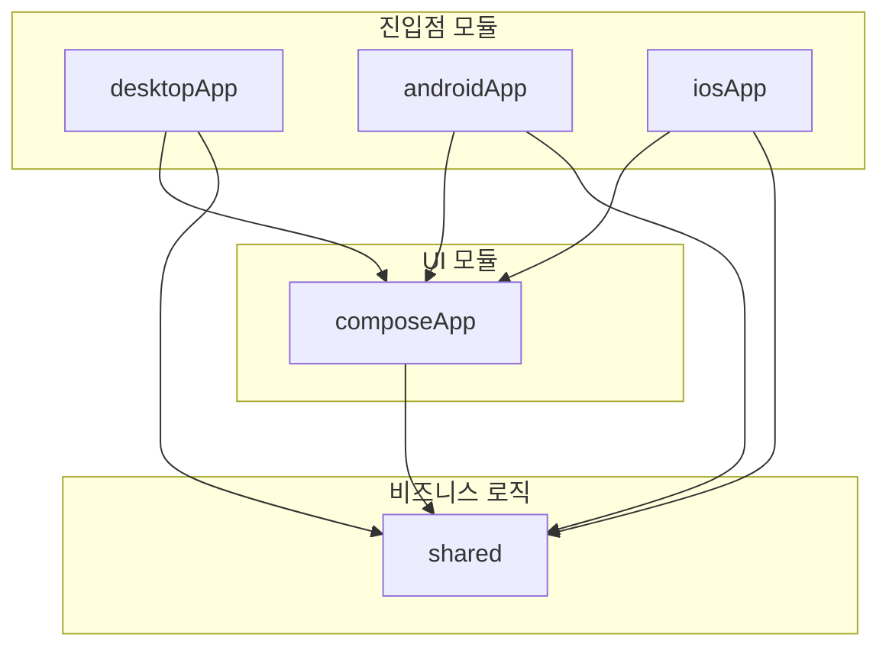
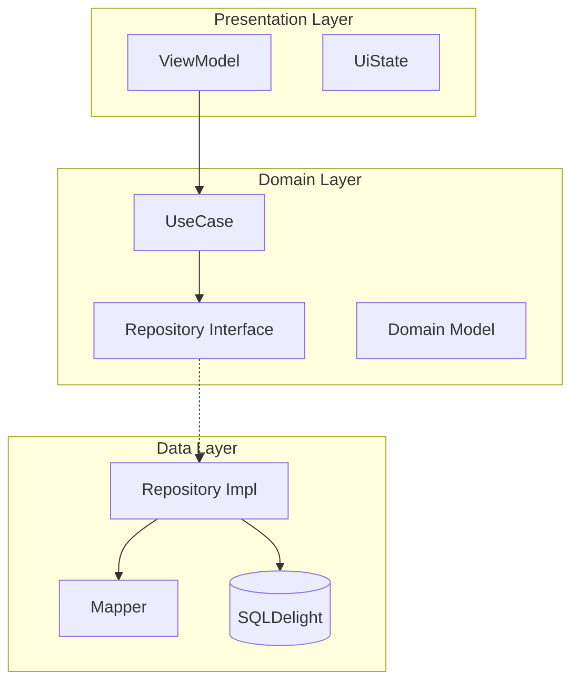
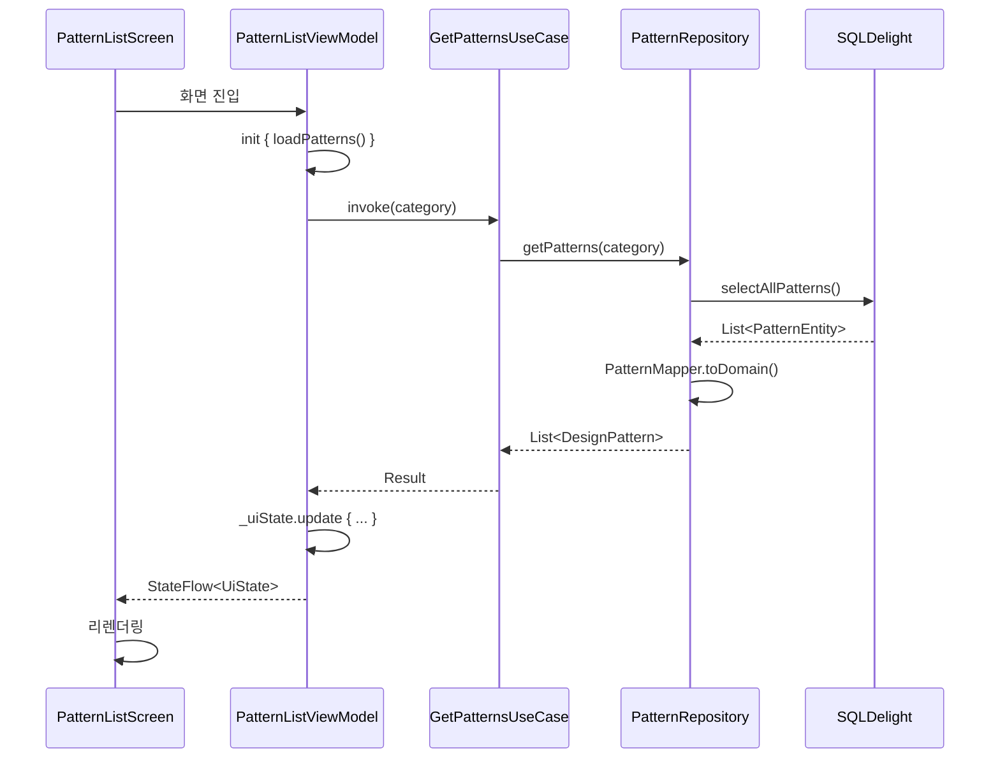

# CodeBlueprint 아키텍처

이 문서는 CodeBlueprint 프로젝트의 상세 아키텍처를 설명합니다.

## 개요

CodeBlueprint는 **Kotlin Multiplatform (KMP)**과 **Compose Multiplatform**을 기반으로 한 크로스 플랫폼 애플리케이션입니다. Clean Architecture와 MVVM 패턴을 적용하여 테스트 가능하고 유지보수가 용이한 구조를 갖추고 있습니다.

---

## 모듈 구조

```
CodeBlueprint/
├── shared/           # KMP 공유 모듈 (비즈니스 로직)
├── composeApp/       # Compose Multiplatform UI 모듈
├── desktopApp/       # Desktop (macOS) 진입점
├── androidApp/       # Android 진입점
└── iosApp/           # iOS 진입점 (Swift)
```

### 모듈 의존성



---

## Clean Architecture 레이어

### 레이어 개요



### 1. Domain Layer (`shared/src/commonMain/kotlin/.../domain/`)

비즈니스 로직의 핵심. 외부 의존성 없이 순수 Kotlin으로 작성됨.

#### 도메인 모델 (`domain/model/`)

| 모델 | 설명 |
|------|------|
| `DesignPattern` | 디자인 패턴 정보 |
| `PatternCategory` | 패턴 카테고리 (생성/구조/행위) |
| `Algorithm` | 알고리즘 정보 |
| `AlgorithmCategory` | 알고리즘 카테고리 (9종) |
| `TimeComplexity` | 시간 복잡도 (best/average/worst) |
| `LearningProgress` | 학습 진도 |
| `Settings` | 사용자 설정 |
| `CodeExample` | 언어별 코드 예시 |
| `Difficulty` | 난이도 (LOW/MEDIUM/HIGH) |

#### 저장소 인터페이스 (`domain/repository/`)

| 인터페이스 | 설명 |
|------------|------|
| `PatternRepository` | 패턴 CRUD 및 검색 |
| `AlgorithmRepository` | 알고리즘 CRUD 및 검색 |
| `SettingsRepository` | 설정 저장/조회 |
| `ArchitectureRepository` | 아키텍처 패턴 조회 |
| `AIRepository` | AI 추천 기능 |
| `CodeExecutionRepository` | 코드 실행 |

#### UseCase (`domain/usecase/`)

단일 책임 원칙에 따라 기능별로 분리된 유스케이스:

**패턴 관련:**
- `GetPatternsUseCase` - 패턴 목록 조회
- `GetPatternDetailUseCase` - 패턴 상세 조회
- `SearchPatternsUseCase` - 패턴 검색
- `ToggleBookmarkUseCase` - 북마크 토글
- `ToggleCompleteUseCase` - 완료 표시 토글

**알고리즘 관련:**
- `GetAlgorithmsUseCase` - 알고리즘 목록 조회
- `GetAlgorithmDetailUseCase` - 알고리즘 상세 조회
- `SearchAlgorithmsUseCase` - 알고리즘 검색
- `ToggleAlgorithmBookmarkUseCase` - 북마크 토글
- `ToggleAlgorithmCompleteUseCase` - 완료 표시 토글

### 2. Data Layer (`shared/src/commonMain/kotlin/.../data/`)

외부 시스템과의 통신 담당.

#### 저장소 구현 (`data/repository/`)

| 구현체 | 저장소 타입 |
|--------|------------|
| `PatternRepositoryImpl` | SQLDelight 기반 |
| `AlgorithmRepositoryImpl` | SQLDelight 기반 |
| `SettingsRepositoryImpl` | SQLDelight 기반 |
| `ArchitectureRepositoryImpl` | 메모리 기반 |
| `AIRepositoryImpl` | Mock 구현 |
| `CodeExecutionRepositoryImpl` | Mock 구현 |

#### 매퍼 (`data/mapper/`)

Entity ↔ Domain Model 변환:
- `PatternMapper`
- `AlgorithmMapper`
- `LearningProgressMapper`
- `AlgorithmLearningProgressMapper`
- `SettingsMapper`

#### 로컬 데이터 (`data/local/`)

- `DatabaseDriverFactory` - 플랫폼별 SQLite 드라이버
- `PatternDataInitializer` - 23개 GoF 패턴 초기 데이터
- `AlgorithmDataProvider` - 73개 알고리즘 데이터
- `ArchitectureDataProvider` - 아키텍처 패턴 데이터

### 3. Presentation Layer (`shared/src/commonMain/kotlin/.../presentation/`)

UI 상태 관리 및 사용자 상호작용 처리.

#### ViewModel 구조

```
presentation/
├── base/
│   └── BaseViewModel.kt           # viewModelScope 제공
├── pattern/
│   ├── list/
│   │   ├── PatternListViewModel.kt
│   │   ├── PatternListUiState.kt
│   │   └── PatternUiModel.kt
│   └── detail/
│       ├── PatternDetailViewModel.kt
│       └── PatternDetailUiState.kt
├── algorithm/
│   ├── list/
│   │   ├── AlgorithmListViewModel.kt
│   │   └── AlgorithmListUiState.kt
│   └── detail/
│       └── ...
├── search/
├── bookmarks/
├── settings/
├── architecture/
├── ai/
└── playground/
```

---

## UI Layer (`composeApp/`)

Compose Multiplatform 기반 공유 UI.

### 화면 구조

```
ui/
├── App.kt                    # 루트 컴포저블
├── navigation/
│   └── RootComponent.kt      # Decompose 네비게이션
├── theme/
│   └── Theme.kt              # Material 3 테마
├── pattern/
│   ├── list/PatternListScreen.kt
│   └── detail/PatternDetailScreen.kt
├── algorithm/
│   ├── list/AlgorithmListScreen.kt
│   └── detail/AlgorithmDetailScreen.kt
├── search/SearchScreen.kt
├── bookmarks/BookmarksScreen.kt
├── settings/SettingsScreen.kt
├── architecture/
├── ai/AIAdvisorScreen.kt
└── playground/CodePlaygroundScreen.kt
```

### 네비게이션 (Decompose)

```kotlin
sealed class Config : Parcelable {
    data object PatternList : Config()
    data class PatternDetail(val patternId: String) : Config()
    data object AlgorithmList : Config()
    data class AlgorithmDetail(val algorithmId: String) : Config()
    data object Search : Config()
    data object Bookmarks : Config()
    data object Settings : Config()
    // ...
}
```

---

## 플랫폼별 구현

### 플랫폼 모듈 구조

```
shared/src/
├── commonMain/           # 공통 코드
├── androidMain/          # Android 전용
│   └── kotlin/.../
│       ├── DatabaseDriverFactory.kt  # AndroidSqliteDriver
│       ├── KoinInit.kt               # androidContext 주입
│       └── PlatformModule.kt
├── desktopMain/          # Desktop 전용
│   └── kotlin/.../
│       ├── DatabaseDriverFactory.kt  # JdbcSqliteDriver
│       ├── KoinInit.kt               # runBlocking 초기화
│       └── PlatformModule.kt
└── iosMain/              # iOS 전용
    └── kotlin/.../
        ├── DatabaseDriverFactory.kt  # NativeSqliteDriver
        ├── KoinInit.kt               # Swift 호출용
        └── PlatformModule.kt
```

### 데이터베이스 드라이버

| 플랫폼 | 드라이버 | 저장 위치 |
|--------|---------|----------|
| Desktop | `JdbcSqliteDriver` | `~/.codeblueprint/codeblueprint.db` |
| Android | `AndroidSqliteDriver` | 앱 내부 저장소 |
| iOS | `NativeSqliteDriver` | 앱 내부 저장소 |

---

## 의존성 주입 (Koin)

### 모듈 구조 (`di/Modules.kt`)

```kotlin
val domainModule = module {
    // UseCase
    factory { GetPatternsUseCase(get()) }
    factory { GetPatternDetailUseCase(get()) }
    // ...
}

val dataModule = module {
    // Database
    single { get<DatabaseDriverFactory>().createDriver() }
    single { CodeBlueprintDatabase(get()) }

    // Repository
    single<PatternRepository> { PatternRepositoryImpl(get(), get()) }
    // ...
}

val presentationModule = module {
    // ViewModel
    viewModel { PatternListViewModel(get()) }
    viewModel { (patternId: String) -> PatternDetailViewModel(patternId, get()) }
    // ...
}
```

### 플랫폼별 초기화

**Desktop:**
```kotlin
fun initKoin() {
    startKoin {
        modules(allModules())
    }
    // 패턴 데이터 초기화
    runBlocking {
        get<PatternDataInitializer>().initializeIfNeeded()
    }
}
```

**Android:**
```kotlin
fun initKoin(context: Context) {
    startKoin {
        androidLogger()
        androidContext(context)
        modules(allModules())
    }
}
```

**iOS:**
```kotlin
fun doInitKoin() {
    startKoin {
        modules(allModules())
    }
}
```

---

## 데이터 흐름 예시

### 패턴 목록 조회



---

## SQLDelight 스키마

### 주요 테이블

```sql
-- 패턴 테이블
CREATE TABLE PatternEntity (
    id TEXT PRIMARY KEY,
    name TEXT NOT NULL,
    korean_name TEXT NOT NULL,
    category TEXT NOT NULL,
    purpose TEXT NOT NULL,
    characteristics TEXT NOT NULL,
    advantages TEXT NOT NULL,
    disadvantages TEXT NOT NULL,
    use_cases TEXT NOT NULL,
    code_examples TEXT NOT NULL,
    diagram TEXT NOT NULL,
    related_pattern_ids TEXT NOT NULL,
    difficulty TEXT NOT NULL,
    frequency INTEGER NOT NULL
);

-- 학습 진도 테이블
CREATE TABLE LearningProgressEntity (
    pattern_id TEXT PRIMARY KEY,
    is_completed INTEGER NOT NULL DEFAULT 0,
    last_viewed_at INTEGER,
    notes TEXT,
    is_bookmarked INTEGER NOT NULL DEFAULT 0
);

-- 알고리즘 테이블
CREATE TABLE AlgorithmEntity (
    id TEXT PRIMARY KEY,
    name TEXT NOT NULL,
    korean_name TEXT NOT NULL,
    category TEXT NOT NULL,
    purpose TEXT NOT NULL,
    time_complexity_best TEXT NOT NULL,
    time_complexity_average TEXT NOT NULL,
    time_complexity_worst TEXT NOT NULL,
    space_complexity TEXT NOT NULL,
    characteristics TEXT NOT NULL,
    advantages TEXT NOT NULL,
    disadvantages TEXT NOT NULL,
    use_cases TEXT NOT NULL,
    code_examples TEXT NOT NULL,
    related_algorithm_ids TEXT NOT NULL,
    difficulty TEXT NOT NULL,
    frequency INTEGER NOT NULL
);
```

---

## 확장 가이드

### 새 패턴 추가

1. `PatternDataInitializer.kt`에 패턴 데이터 추가
2. MCP 서버의 `patterns.json` 업데이트
3. SKILL 레퍼런스 문서 업데이트

### 새 화면 추가

1. `RootComponent.kt`에 Config 추가
2. `presentation/`에 ViewModel, UiState 생성
3. `ui/`에 Screen 컴포저블 생성
4. `Modules.kt`에 ViewModel 등록

### 새 기능 추가

1. Domain Layer: Model, Repository Interface, UseCase 정의
2. Data Layer: Repository 구현, Mapper 작성
3. Presentation Layer: ViewModel, UiState 작성
4. UI Layer: Screen 컴포저블 작성

---

## 참고 자료

- [Kotlin Multiplatform](https://kotlinlang.org/docs/multiplatform.html)
- [Compose Multiplatform](https://www.jetbrains.com/lp/compose-multiplatform/)
- [SQLDelight](https://cashapp.github.io/sqldelight/)
- [Koin](https://insert-koin.io/)
- [Decompose](https://arkivanov.github.io/Decompose/)
