# 행위 패턴 (Behavioral Patterns)

객체 간의 상호작용과 책임 분배를 다룹니다.

---

## 1. Chain of Responsibility (책임 연쇄)

**목적**: 요청을 처리할 객체를 체인 형태로 연결하여, 요청이 처리될 때까지 체인을 따라 전달합니다.

**특징**:
- 요청이 처리될 때까지 체인을 따라 전달
- 송신자와 수신자 분리

**장점**:
- 요청 송신자와 수신자 분리
- 처리자 동적 추가/제거 가능

**단점**:
- 요청이 처리되지 않을 수 있음

**활용 예시**:
- 이벤트 버블링
- 로깅 시스템
- 미들웨어 체인

**난이도**: 중간 | **사용 빈도**: ★★★☆☆

**클래스 다이어그램**:
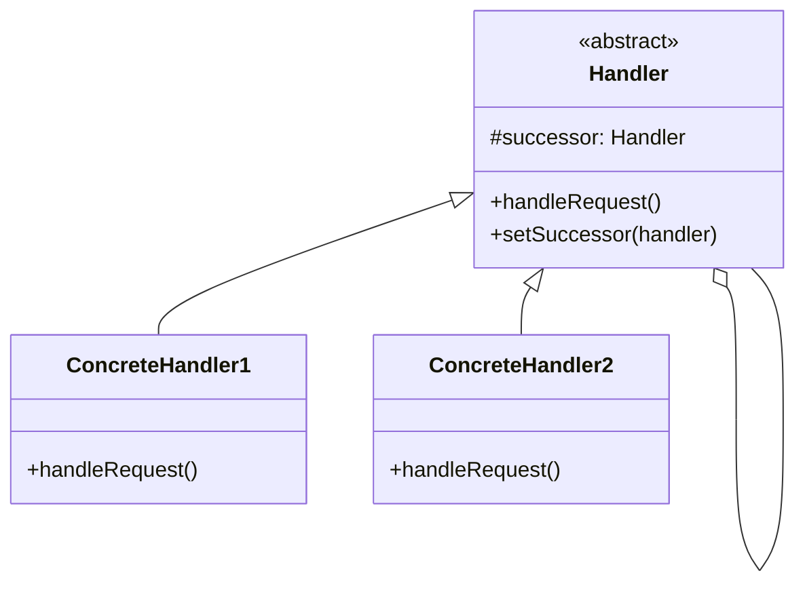

**관련 패턴**: Command, Mediator

---

## 2. Command (커맨드)

**목적**: 요청을 객체로 캡슐화하여, 요청의 실행, 취소, 재실행을 가능하게 합니다.

**특징**:
- 요청을 실행, 취소, 재실행 가능
- 요청 송신자와 수신자 분리

**장점**:
- Undo/Redo 구현 용이
- 명령 큐 및 로깅 가능

**단점**:
- 커맨드 클래스 수 증가

**활용 예시**:
- GUI 버튼 동작
- 작업 취소/재실행
- 트랜잭션 시스템

**난이도**: 중간 | **사용 빈도**: ★★★★☆

**클래스 다이어그램**:
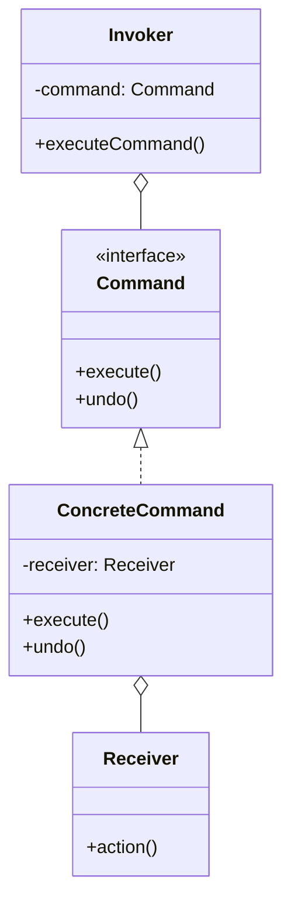

**관련 패턴**: Memento, Chain of Responsibility

---

## 3. Iterator (반복자)

**목적**: 내부 구조를 노출하지 않고 컬렉션 요소에 순차적으로 접근하는 방법을 제공합니다.

**특징**:
- 통일된 인터페이스로 다양한 컬렉션 순회
- 컬렉션과 순회 알고리즘 분리

**장점**:
- 컬렉션 구현과 순회 알고리즘 분리
- 단일 책임 원칙 준수

**단점**:
- 간단한 컬렉션에는 오버킬

**활용 예시**:
- Java Collection Framework
- 데이터베이스 결과셋 순회
- Kotlin의 Sequence

**난이도**: 낮음 | **사용 빈도**: ★★★★★

**클래스 다이어그램**:
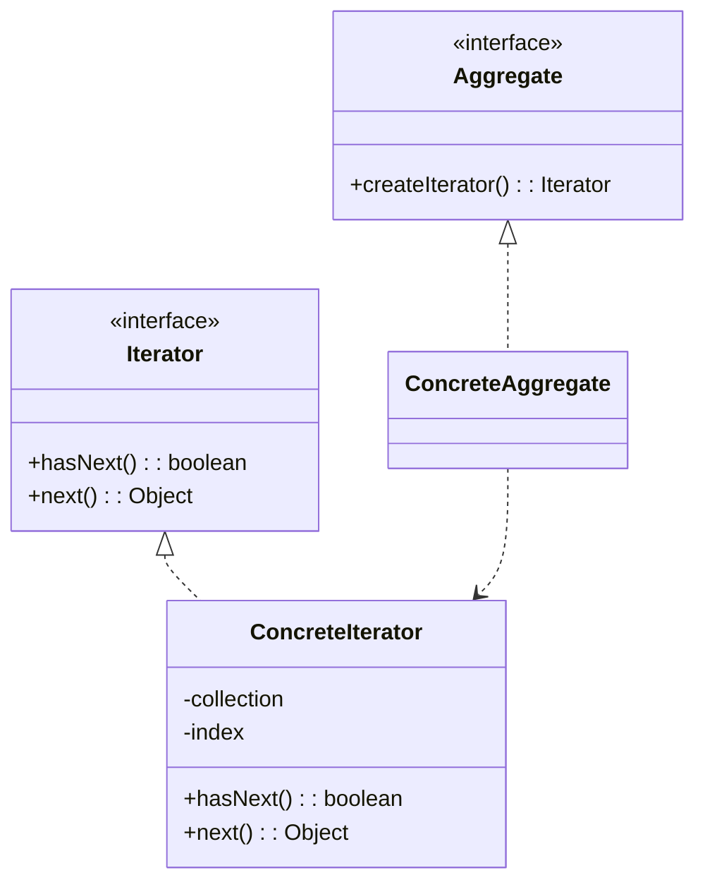

**관련 패턴**: Composite, Visitor

---

## 4. Mediator (중재자)

**목적**: 객체 간 직접 통신을 제한하고, 중재자를 통해서만 협력하도록 합니다.

**특징**:
- 다대다 관계를 일대다 관계로 단순화
- 중앙집중식 제어

**장점**:
- 컴포넌트 간 결합도 감소
- 통신 로직 중앙화

**단점**:
- 중재자가 복잡해질 수 있음

**활용 예시**:
- 채팅방 시스템
- 공항 관제탑
- 이벤트 버스

**난이도**: 중간 | **사용 빈도**: ★★★☆☆

**클래스 다이어그램**:
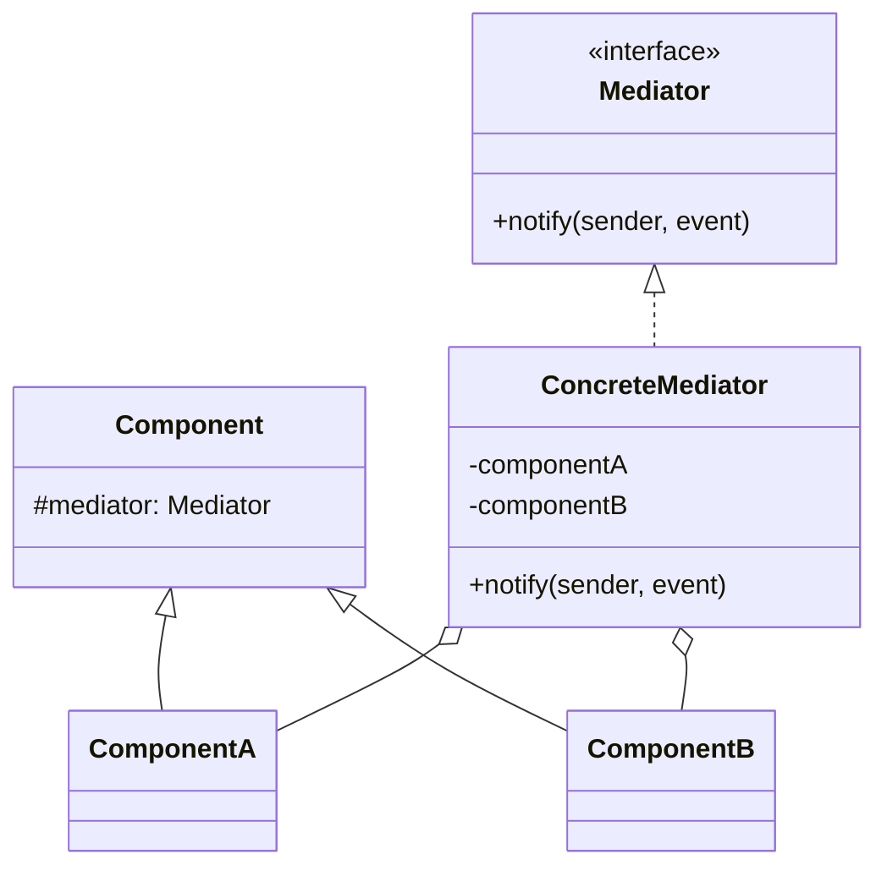

**관련 패턴**: Facade, Observer

---

## 5. Memento (메멘토)

**목적**: 캡슐화를 위배하지 않으면서 객체의 내부 상태를 저장하고 복원합니다.

**특징**:
- 캡슐화를 위배하지 않음
- 상태 이력 관리

**장점**:
- Undo/Redo 구현 용이
- 객체 상태 이력 관리

**단점**:
- 메모리 사용량 증가

**활용 예시**:
- 텍스트 에디터 Undo
- 게임 세이브/로드
- 트랜잭션 롤백

**난이도**: 중간 | **사용 빈도**: ★★★☆☆

**클래스 다이어그램**:
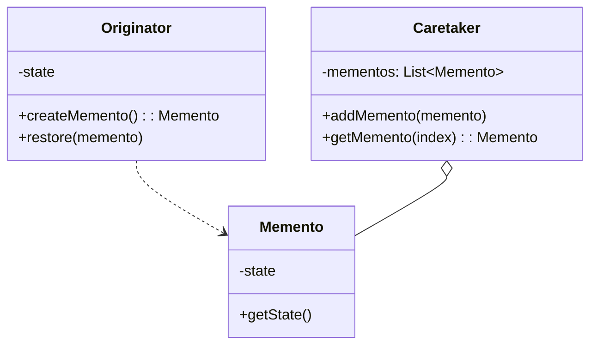

**관련 패턴**: Command, Iterator

---

## 6. Observer (옵저버)

**목적**: 객체 상태 변화를 관찰자들에게 자동으로 통지합니다.

**특징**:
- 일대다 의존성 정의
- 발행-구독 모델

**장점**:
- 느슨한 결합
- 동적으로 구독자 추가/제거

**단점**:
- 메모리 누수 위험

**활용 예시**:
- 이벤트 리스너
- MVC 패턴
- LiveData, StateFlow (Android)

**난이도**: 중간 | **사용 빈도**: ★★★★★

**클래스 다이어그램**:
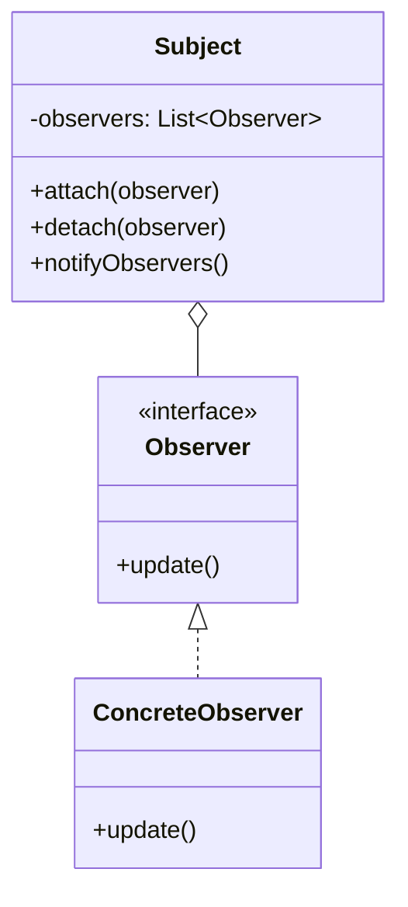

**관련 패턴**: Mediator, Strategy

---

## 7. State (상태)

**목적**: 객체의 내부 상태에 따라 행동을 변경합니다.

**특징**:
- 상태를 별도 클래스로 캡슐화
- 상태 전이 관리

**장점**:
- 단일 책임 원칙 준수
- 조건문 제거로 코드 간소화

**단점**:
- 상태가 적으면 과도한 설계

**활용 예시**:
- TCP 연결 상태
- 주문 상태 (결제대기, 배송중, 완료)
- 미디어 플레이어 상태

**난이도**: 중간 | **사용 빈도**: ★★★★☆

**클래스 다이어그램**:
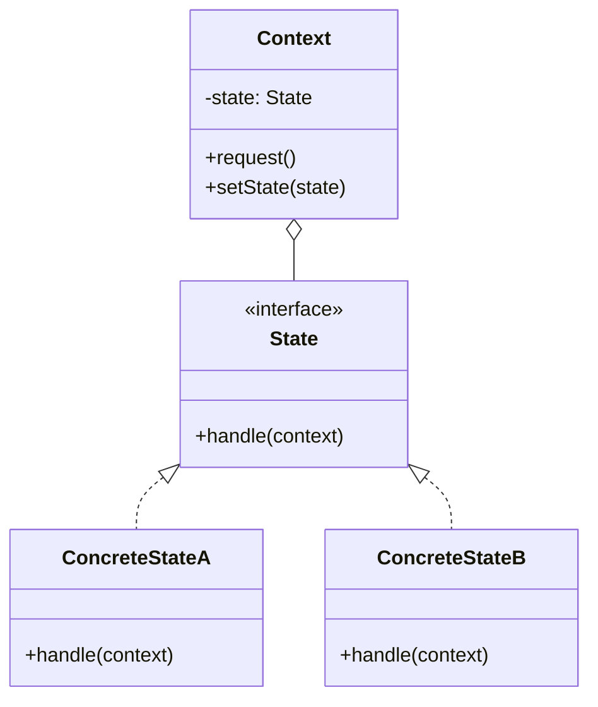

**관련 패턴**: Strategy, Singleton

---

## 8. Strategy (전략)

**목적**: 알고리즘 군을 정의하고 캡슐화하여 교환 가능하게 만듭니다.

**특징**:
- 런타임에 알고리즘 변경 가능
- 조건문 대체

**장점**:
- 개방-폐쇄 원칙 준수
- 런타임에 알고리즘 선택

**단점**:
- 전략 객체 수 증가

**활용 예시**:
- 정렬 알고리즘
- 결제 방법
- 압축 알고리즘

**난이도**: 낮음 | **사용 빈도**: ★★★★★

**클래스 다이어그램**:
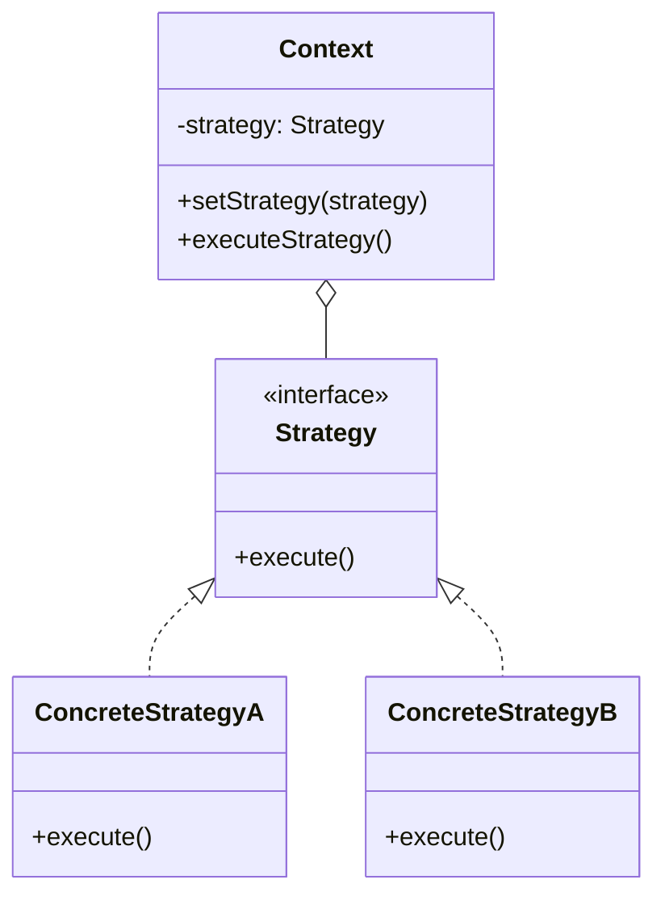

**관련 패턴**: State, Template Method

---

## 9. Template Method (템플릿 메서드)

**목적**: 알고리즘의 골격을 정의하고, 세부 단계는 서브클래스에서 구현합니다.

**특징**:
- 코드 재사용 극대화
- 불변 부분과 가변 부분 분리

**장점**:
- 코드 중복 제거
- 프레임워크 구축에 유용

**단점**:
- 템플릿 메서드가 많아지면 유지보수 어려움

**활용 예시**:
- 프레임워크 라이프사이클 메서드
- 테스트 프레임워크 (setUp, tearDown)
- Android Activity 생명주기

**난이도**: 낮음 | **사용 빈도**: ★★★★☆

**클래스 다이어그램**:
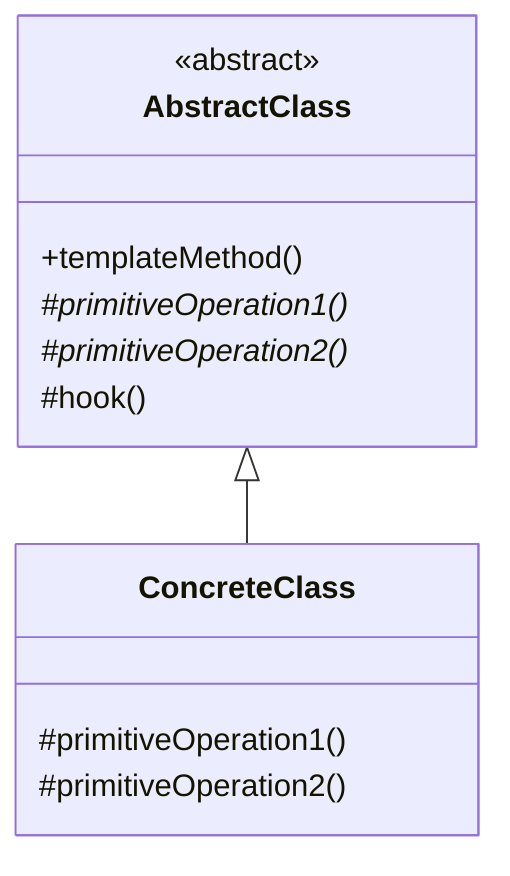

**관련 패턴**: Strategy, Factory Method

---

## 10. Visitor (방문자)

**목적**: 객체 구조에서 수행할 연산을 분리합니다.

**특징**:
- 새로운 연산 추가가 용이
- Double Dispatch 활용

**장점**:
- 개방-폐쇄 원칙 준수
- 연산 관련 코드 한 곳에 모음

**단점**:
- 새로운 클래스 추가가 어려움

**활용 예시**:
- 컴파일러의 AST 순회
- 보고서 생성
- 문서 내보내기 (PDF, HTML, XML)

**난이도**: 높음 | **사용 빈도**: ★★☆☆☆

**클래스 다이어그램**:
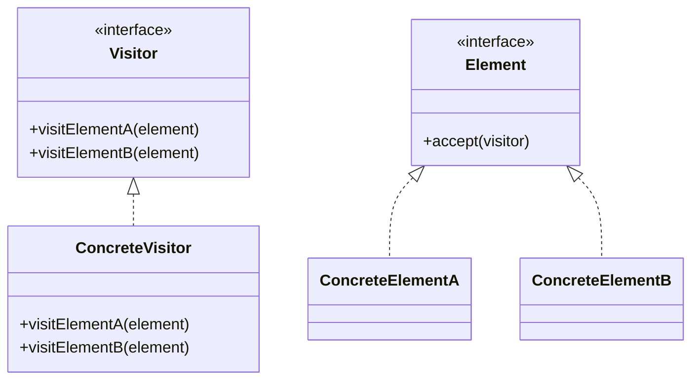

**관련 패턴**: Composite, Iterator

---

## 11. Interpreter (인터프리터)

**목적**: 언어의 문법 표현 및 해석기를 정의합니다.

**특징**:
- 간단한 언어 구현
- 문법 규칙을 클래스로 표현

**장점**:
- 문법 변경 및 확장 용이

**단점**:
- 복잡한 문법은 유지보수 어려움

**활용 예시**:
- SQL 파서
- 정규 표현식
- DSL 구현

**난이도**: 높음 | **사용 빈도**: ★☆☆☆☆

**클래스 다이어그램**:
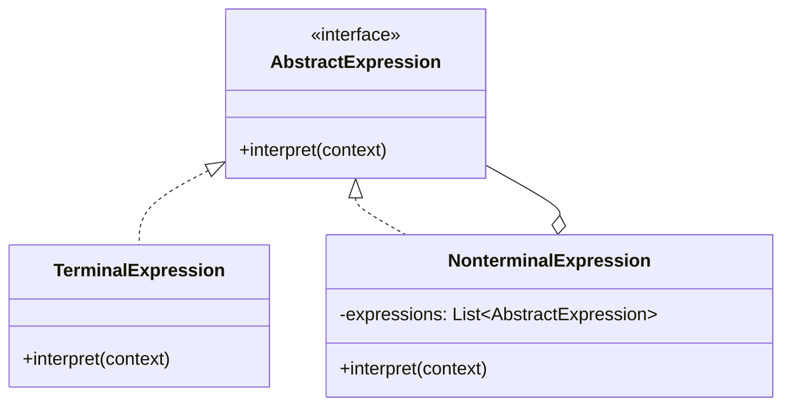

**관련 패턴**: Composite, Visitor
