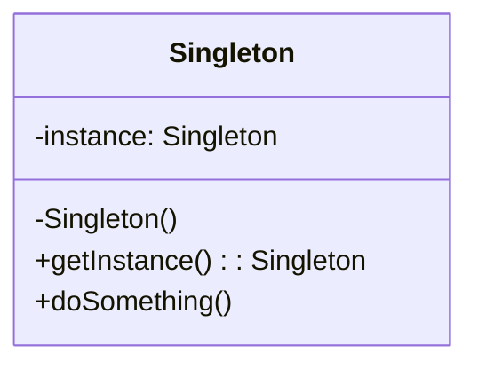
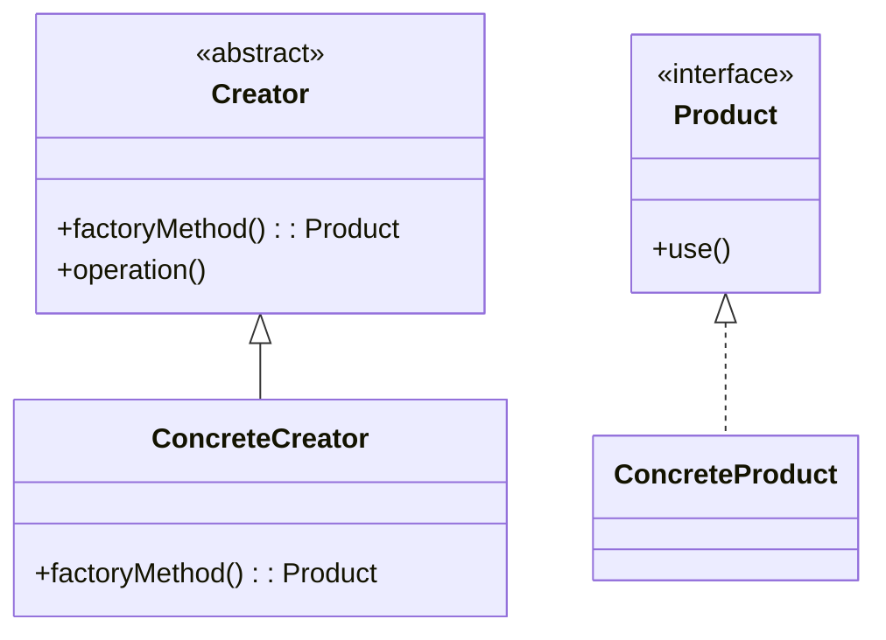
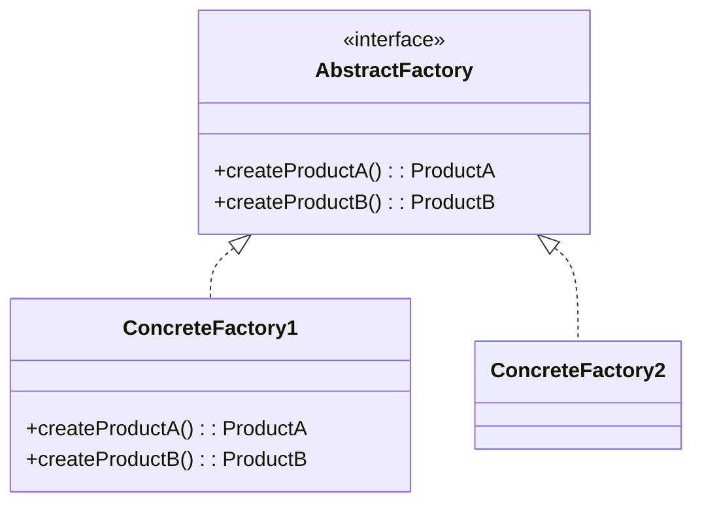
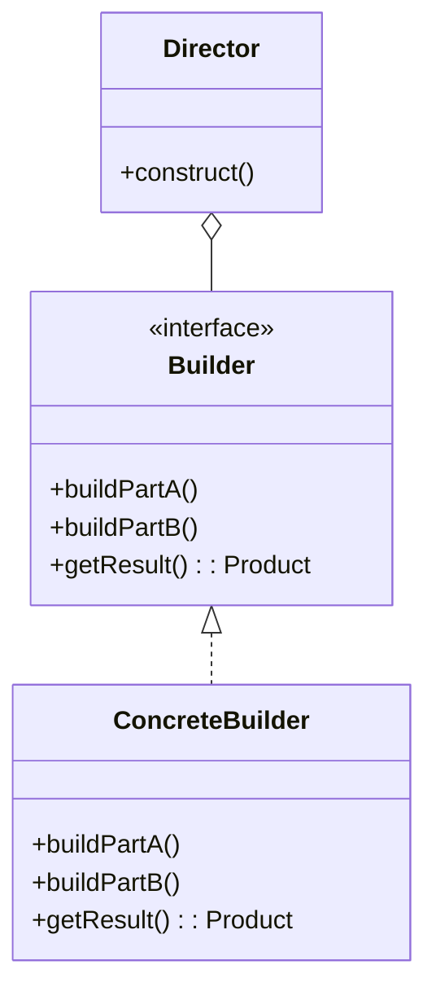
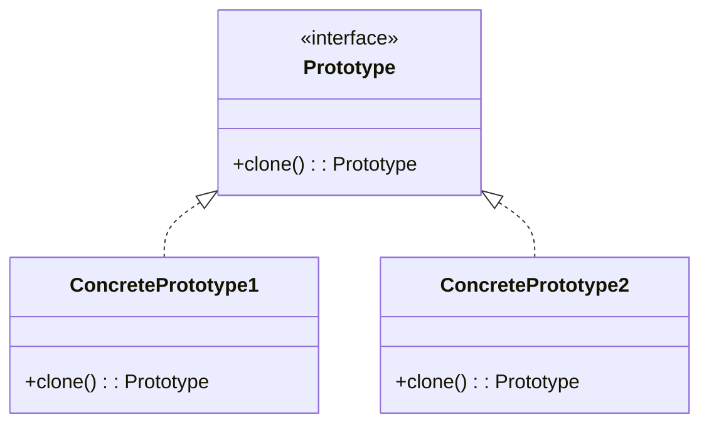

# 생성 패턴 (Creational Patterns)

객체 생성 메커니즘을 다루며, 상황에 맞게 객체를 생성하는 방법을 제공합니다.

---

## 1. Singleton (싱글톤)

**목적**: 클래스의 인스턴스를 오직 하나만 생성하도록 보장하고, 전역적인 접근점을 제공합니다.

**특징**:
- 전역적으로 접근 가능한 단일 인스턴스
- 인스턴스 생성 제어
- 지연 초기화(Lazy Initialization) 가능

**장점**:
- 메모리 낭비 방지
- 전역 상태 관리 용이
- 리소스 공유 효율적

**단점**:
- 전역 상태로 인한 결합도 증가
- 멀티스레드 환경에서 동기화 필요
- 테스트 어려움 (Mock 객체 생성 어려움)
- 단일 책임 원칙 위반 가능

**활용 예시**:
- 데이터베이스 연결 풀
- 로거(Logger) 클래스
- 설정(Configuration) 관리자
- 캐시 관리 시스템

**난이도**: 낮음 | **사용 빈도**: ★★★★★

**클래스 다이어그램**:

**관련 패턴**: Factory Method, Prototype

---

## 2. Factory Method (팩토리 메서드)

**목적**: 객체 생성을 서브클래스에 위임하여, 어떤 클래스의 인스턴스를 생성할지 서브클래스가 결정하도록 합니다.

**특징**:
- 인터페이스를 통해 객체 생성
- 구체적인 클래스는 서브클래스가 결정
- 생성 로직의 캡슐화

**장점**:
- 객체 생성 코드와 사용 코드 분리
- 개방-폐쇄 원칙(OCP) 준수
- 새로운 타입 추가 시 기존 코드 수정 불필요
- 단일 책임 원칙 준수

**단점**:
- 클래스 개수 증가로 코드 복잡도 증가
- 간단한 객체 생성에는 과도한 설계

**활용 예시**:
- UI 컴포넌트 생성 (Button, Dialog)
- 문서 생성기 (PDF, Word, Excel)
- 데이터베이스 연결 (MySQL, PostgreSQL)
- 로깅 프레임워크

**난이도**: 중간 | **사용 빈도**: ★★★★★

**클래스 다이어그램**:

**관련 패턴**: Abstract Factory, Singleton

---

## 3. Abstract Factory (추상 팩토리)

**목적**: 관련된 객체들의 패밀리를 생성하기 위한 인터페이스를 제공합니다.

**특징**:
- 관련 객체 집합 생성
- 구체 클래스 분리
- 제품군 교체 용이

**장점**:
- 제품군의 일관성 보장
- 구체 클래스 분리로 클라이언트 코드 독립성 확보
- 제품군 교체 용이

**단점**:
- 새로운 제품 추가 시 모든 팩토리 수정 필요
- 코드 복잡도 증가

**활용 예시**:
- 크로스 플랫폼 UI 툴킷
- 데이터베이스 드라이버 전체 컴포넌트
- 테마 시스템 (다크 모드, 라이트 모드)

**난이도**: 높음 | **사용 빈도**: ★★★☆☆

**클래스 다이어그램**:

**관련 패턴**: Factory Method, Builder

---

## 4. Builder (빌더)

**목적**: 복잡한 객체의 생성 과정과 표현 방법을 분리하여, 동일한 생성 절차에서 다른 표현 결과를 만들 수 있게 합니다.

**특징**:
- 단계별 객체 생성
- 동일한 생성 절차로 다른 표현 생성
- 생성 과정과 표현 분리

**장점**:
- 가독성 높은 객체 생성 코드
- 불변 객체 생성 용이
- 선택적 매개변수 처리 용이

**단점**:
- 코드 양 증가
- 간단한 객체에는 오버엔지니어링

**활용 예시**:
- StringBuilder, StringBuffer
- HTTP 요청 빌더
- SQL 쿼리 빌더
- AlertDialog.Builder (Android)

**난이도**: 중간 | **사용 빈도**: ★★★★★

**클래스 다이어그램**:

**관련 패턴**: Abstract Factory, Prototype

---

## 5. Prototype (프로토타입)

**목적**: 기존 객체를 복제하여 새로운 객체를 생성합니다.

**특징**:
- 객체 생성 비용이 클 때 사용
- 복제를 통한 새 인스턴스 생성
- 런타임에 동적으로 객체 추가 가능

**장점**:
- 객체 생성 비용 절감
- 복잡한 객체 생성 과정 단순화

**단점**:
- 깊은 복사(Deep Copy) 구현이 복잡
- 순환 참조 문제 발생 가능

**활용 예시**:
- 게임 캐릭터 복제
- 문서 템플릿 복사
- Kotlin data class의 `copy()` 메서드

**난이도**: 중간 | **사용 빈도**: ★★☆☆☆

**클래스 다이어그램**:

**관련 패턴**: Factory Method, Singleton
