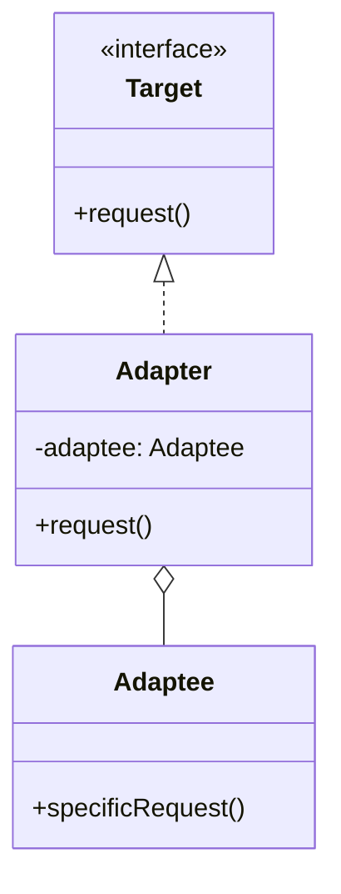
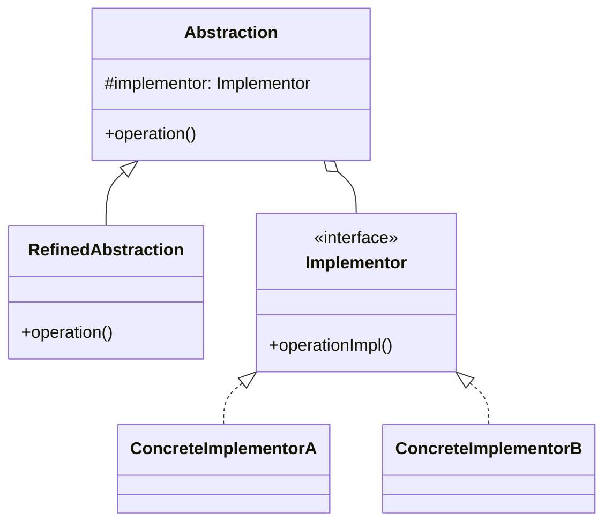
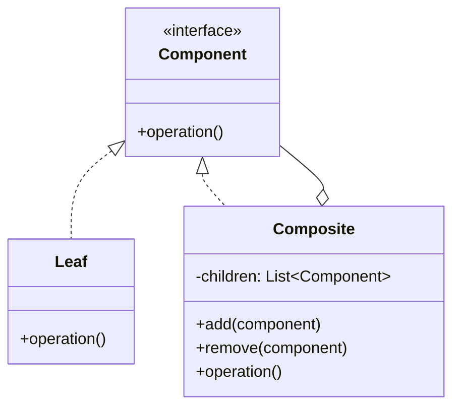
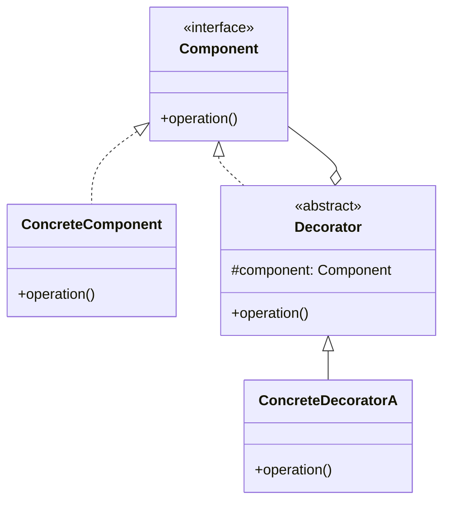
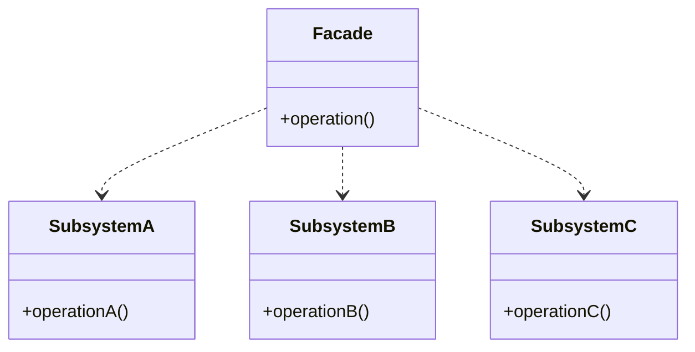
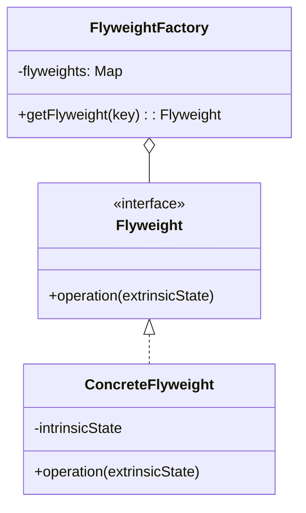
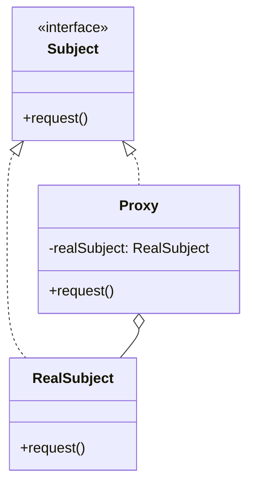

# 구조 패턴 (Structural Patterns)

클래스와 객체를 더 큰 구조로 조합하는 방법을 다룹니다.

---

## 1. Adapter (어댑터)

**목적**: 호환되지 않는 인터페이스를 가진 객체들이 협력할 수 있도록 래퍼 역할을 합니다.

**특징**:
- 래퍼(Wrapper) 역할
- 기존 클래스 수정 없이 호환성 제공
- 인터페이스 변환

**장점**:
- 기존 코드 수정 없이 호환성 제공
- 단일 책임 원칙 준수

**단점**:
- 코드 복잡도 증가

**활용 예시**:
- 레거시 시스템과 신규 시스템 통합
- 서드파티 라이브러리 통합
- RecyclerView.Adapter (Android)

**난이도**: 낮음 | **사용 빈도**: ★★★★★

**클래스 다이어그램**:

**관련 패턴**: Bridge, Decorator, Proxy

---

## 2. Bridge (브릿지)

**목적**: 추상화와 구현을 분리하여 독립적으로 변경할 수 있게 합니다.

**특징**:
- 구현부와 추상부를 별도 클래스 계층으로 분리
- 복합(Composition) 활용
- 런타임에 구현 변경 가능

**장점**:
- 추상화와 구현의 독립적 확장
- 구현 세부사항을 클라이언트로부터 숨김

**단점**:
- 코드 복잡도 증가

**활용 예시**:
- 플랫폼 독립적 애플리케이션
- 그래픽 렌더링 시스템
- 드라이버 인터페이스

**난이도**: 높음 | **사용 빈도**: ★★☆☆☆

**클래스 다이어그램**:

**관련 패턴**: Adapter, Strategy

---

## 3. Composite (컴포지트)

**목적**: 객체들을 트리 구조로 구성하여 부분-전체 계층을 표현합니다.

**특징**:
- 개별 객체와 복합 객체를 동일하게 취급
- 재귀적 구조
- 트리 계층 표현

**장점**:
- 복잡한 트리 구조 간편 관리
- 다형성과 재귀 활용

**단점**:
- 설계가 지나치게 일반화될 수 있음

**활용 예시**:
- 파일 시스템 (폴더-파일 구조)
- UI 컴포넌트 계층 (ViewGroup - View)
- 조직도

**난이도**: 중간 | **사용 빈도**: ★★★☆☆

**클래스 다이어그램**:

**관련 패턴**: Decorator, Iterator

---

## 4. Decorator (데코레이터)

**목적**: 객체에 동적으로 새로운 기능을 추가합니다.

**특징**:
- 상속 없이 객체 확장
- 래퍼를 통한 기능 추가
- 런타임에 동적 기능 추가/제거

**장점**:
- 런타임에 동적으로 기능 추가/제거
- 단일 책임 원칙 준수

**단점**:
- 작은 객체들이 많이 생성됨

**활용 예시**:
- Java I/O Stream (BufferedInputStream, DataInputStream)
- GUI 컴포넌트 스크롤바, 테두리 추가
- 미들웨어 체인

**난이도**: 중간 | **사용 빈도**: ★★★★☆

**클래스 다이어그램**:

**관련 패턴**: Adapter, Composite, Strategy

---

## 5. Facade (퍼사드)

**목적**: 복잡한 서브시스템에 대한 단순화된 인터페이스를 제공합니다.

**특징**:
- 서브시스템의 복잡성을 감춤
- 고수준 인터페이스 제공

**장점**:
- 시스템 사용 간소화
- 서브시스템과 클라이언트 간 결합도 감소

**단점**:
- 퍼사드가 God Object가 될 수 있음

**활용 예시**:
- 컴파일러 인터페이스
- 비디오 변환 라이브러리
- API 게이트웨이

**난이도**: 낮음 | **사용 빈도**: ★★★★★

**클래스 다이어그램**:

**관련 패턴**: Adapter, Mediator

---

## 6. Flyweight (플라이웨이트)

**목적**: 공유를 통해 대량의 객체를 효율적으로 지원합니다.

**특징**:
- 메모리 사용 최적화
- 내재 상태(Intrinsic)와 외재 상태(Extrinsic) 분리

**장점**:
- 메모리 사용량 대폭 감소

**단점**:
- 코드 복잡도 증가

**활용 예시**:
- 텍스트 에디터의 문자 렌더링
- 게임의 파티클 시스템
- 캐시 시스템

**난이도**: 높음 | **사용 빈도**: ★★☆☆☆

**클래스 다이어그램**:

**관련 패턴**: Composite, Singleton

---

## 7. Proxy (프록시)

**목적**: 다른 객체에 대한 접근을 제어하는 대리자를 제공합니다.

**특징**:
- 실제 객체에 대한 간접 참조
- 추가 기능 제공 (로깅, 캐싱, 접근 제어)

**장점**:
- 실제 객체 접근 제어
- 지연 초기화 (Lazy Initialization)

**단점**:
- 응답 시간 증가 가능

**활용 예시**:
- 가상 프록시 (이미지 지연 로딩)
- 보호 프록시 (접근 권한 제어)
- 원격 프록시 (네트워크 통신)
- Kotlin의 lazy 위임

**난이도**: 중간 | **사용 빈도**: ★★★★☆

**클래스 다이어그램**:

**관련 패턴**: Adapter, Decorator
